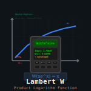

# hp-41_wlambert

[](https://en.wikipedia.org/wiki/HP-41C)
[](https://unlicense.org/)
[](https://github.com/isene/hp-41_wlambert/stargazers)
[](https://isene.org)



## HP-41: This program calculates the W Lambert function

The program originated from over at the HP Forum, were I sought a solution to the equation "b=(a^x)/x" solved for x. This cannot be done without resorting to the W Lambert function.

Thomas Klemm and Gerson W. Barbosa offered solutions to the W function as HP-41 programs. I simply merged the programs into one. Subsequently, Gerson embarked upon a quest to enhance the program, enticing Dieter and others on the HP Forum to contribute. I added a simple interface to Dieter’s final take.

Example of usage:

The closed form solution to the equation b=(a^x)/x is


In order to solve it for x, we will use the program this way:

```
b ENTER a
LN
CHS
STO 02
X<>Y
/
XEQ "WL"
    You will see the short menu "WP WM" corresponding
    to the labels "A" and "B" in the top row keys.

    Press the USER key (if you haven't done so yet) then
A   (or B for the second real solution, in case there is one)

RCL 02
/
```

For instance, for a = 2 and b = 3 you should get

x1 = 0.457822373 (WP)

and

x2 = 3.313178379 (WM)

The valid limits for WP and WM are:

-1/e <= x <= +inf   (WP)

-1/e <= x < 0   (WM)

## License
This software is released into the Public Domain.
